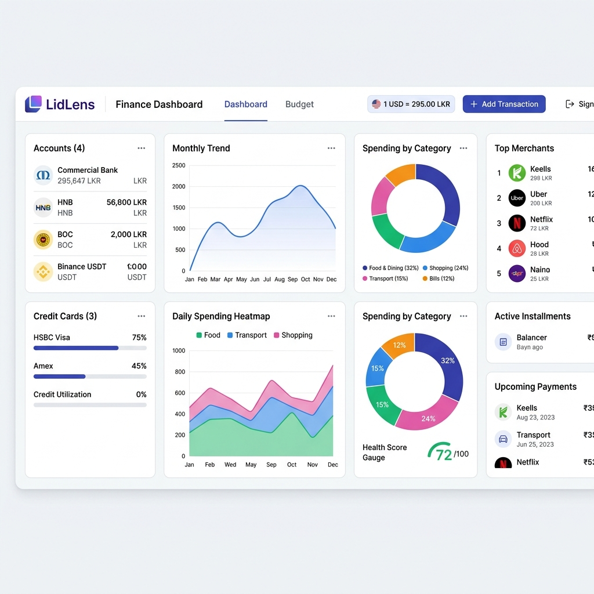
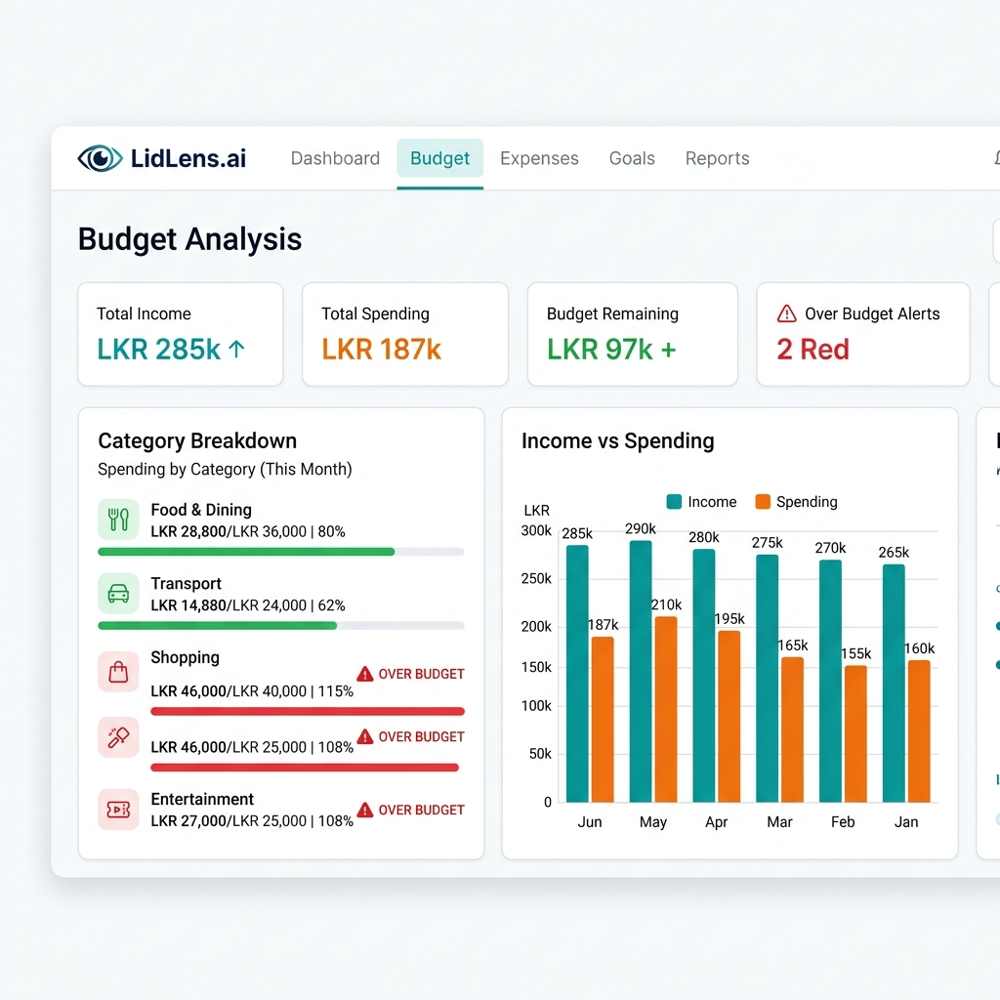
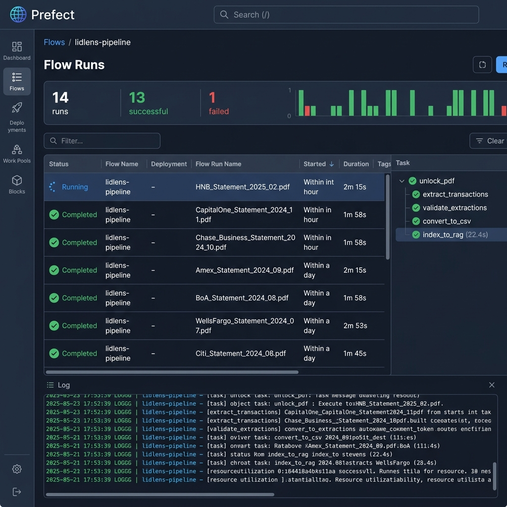
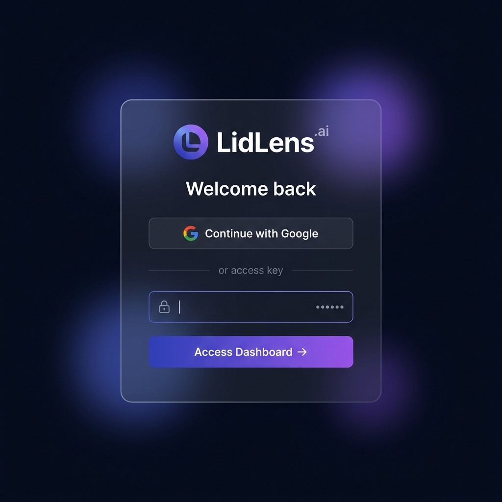
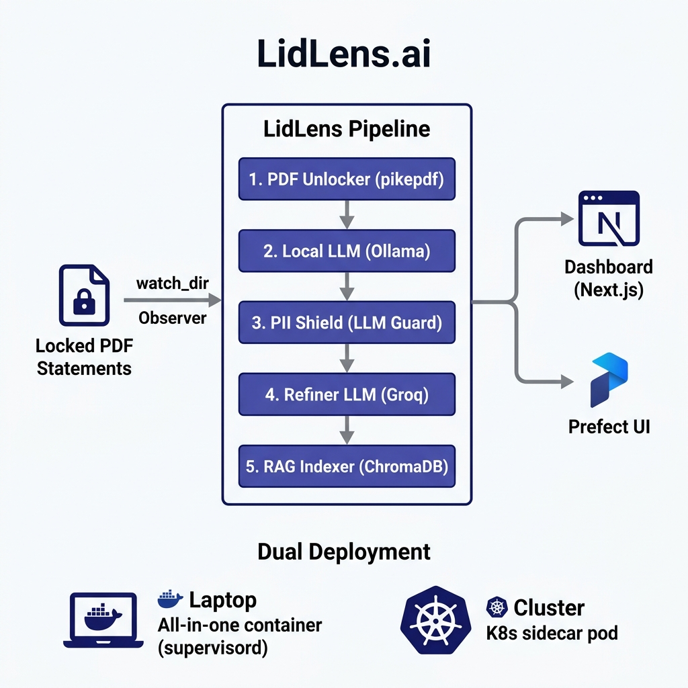

# LidLens.ai

> **Privacy-first personal finance dashboard with AI-powered transaction extraction.**

LidLens.ai is an end-to-end system that unlocks password-protected credit card PDFs, extracts every transaction using local + cloud LLMs, and surfaces your finances through a beautiful secure dashboard — all without sending raw financial data to external services.

---

## 📸 Screenshots

### Main Dashboard



*Real-time overview of accounts, credit cards, spending by category (donut chart), monthly trend, daily heatmap, top merchants, installments, and upcoming payments — all on one screen.*

---

### Budget Analysis



*Category-level budget limits with live overspend alerts (red highlight). Income vs. spending grouped bar chart across 6 months. Monthly obligations breakdown. Budget limits are saved per user in SQLite and persist across sessions.*

---

### Pipeline Monitoring (Prefect UI)



*Every PDF extraction run is tracked as a Prefect flow. See all 5 tasks — unlock, extract, validate, convert, index — with duration, logs, and error traces. The Prefect UI runs on port 4200 alongside the dashboard.*

---

### Login Page



*NextAuth.js-powered login with Google OAuth ("Continue with Google") or password access key. Dark glass-morphism design. Sessions expire after 7 days.*

---

## 🏗️ Architecture



### How it works

```
Your PDF → watch_dir → Prefect Pipeline → JSON → Dashboard
                           │
                     5 sequential tasks:
                     1. Unlock PDF (pikepdf)
                     2. Extract (Ollama local LLM)
                     3. Guard PII (LLM Guard)
                     4. Refine (Groq cloud LLM)
                     5. Validate + Index (ChromaDB RAG)
```

### Tech Stack

| Layer | Technology | Role |
|-------|-----------|------|
| **Dashboard** | Next.js 14, Recharts, Tailwind CSS | Financial analytics UI |
| **Auth** | NextAuth.js v5 (JWT cookies) | Google OAuth + password login |
| **User Preferences** | SQLite (`better-sqlite3`) | Per-user budget limits, UI settings |
| **Pipeline** | Prefect 3 | Visual flow orchestration |
| **Packages (Python)** | **uv** + `pyproject.toml` | Fast, reproducible Python deps |
| **Local LLM** | Ollama (`qwen2:7b`) | Offline raw extraction, deterministic |
| **Cloud LLM** | Groq (`gpt-oss-120b`) | Refinement & categorisation |
| **PII Protection** | LLM Guard | Sanitises all prompts and responses |
| **RAG** | ChromaDB + sentence-transformers | Category learning from history |
| **Watcher** | watchdog | Observer — auto-triggers on new PDFs |
| **Containers** | Docker, Docker Compose | Cross-platform packaging |
| **Cluster** | Kubernetes (sidecar pattern) | Production deployment |
| **Ingress** | ingress-nginx | TLS termination + rate limiting |

---

## ✨ Features at a Glance

| Feature | Details |
|---------|---------|
| 🔐 **Login** | Google OAuth OR password access key (NextAuth, JWT sessions) |
| 🏦 **Accounts** | Savings, money market, crypto — sortable with balance history |
| 💳 **Credit Cards** | Usage progress bars, limits, closing balance per statement |
| 📊 **Spending by Category** | Donut chart — click a slice to drill into merchants |
| 📅 **Monthly Trend** | 12-month line chart with transaction count axis |
| 🌡️ **Daily Heatmap** | Stacked area chart by day, coloured by category |
| 🏪 **Top Merchants** | Ranked by spend, filterable by category |
| 💰 **Installments** | Remaining amount, months left, free-on date per card |
| 🔄 **Subscriptions** | Recurring charges with monthly total |
| 📋 **Budget Analysis** | Per-category limits with red overspend alerts (`/budget`) |
| 🗓️ **Upcoming Payments** | Predicted due dates for all recurring items |
| 💱 **Multi-currency** | Live USD/LKR rate, USDT crypto accounts |
| 🛡️ **Financial Health Score** | Composite score based on credit utilisation & net worth |
| ⚙️ **User Preferences** | Budget limits, UI settings saved per-user in SQLite |

---

## ⚡ Quickest Start — Laptop (No Build Required)

> Pull the all-in-one Docker image. Both the dashboard and pipeline watcher run in a single container via `supervisord`.

**Minimum requirements:** Docker Desktop, 4 GB RAM, 2 CPU cores.

```bash
# 1. Get the config files
curl -O https://raw.githubusercontent.com/lidlenslabs/lidlens/main/config.yaml
curl -O https://raw.githubusercontent.com/lidlenslabs/lidlens/main/docker-compose.hub.yaml
curl -O https://raw.githubusercontent.com/lidlenslabs/lidlens/main/.env.example
cp .env.example .env

# 2. Fill in secrets (open .env in any text editor)
#    • NEXTAUTH_SECRET  →  openssl rand -base64 32
#    • AUTH_PASSWORD    →  choose any password
#    • GROQ_API_KEY     →  free at console.groq.com

# 3. Run
docker compose -f docker-compose.hub.yaml up

# Dashboard   →  http://localhost:3000
# Pipeline UI →  http://localhost:4200
```

**Drop a PDF into `./data/card_statements_locked/` — it gets processed automatically.** Results appear in the dashboard within ~3 minutes.

---

## 🛠️ Developer Setup

### Prerequisites

| Tool | Version | Install |
|------|---------|---------|
| Node.js | 18+ | [nodejs.org](https://nodejs.org) |
| uv | latest | `curl -LsSf https://astral.sh/uv/install.sh \| sh` |
| Ollama | latest | [ollama.com](https://ollama.com) |
| Groq API Key | free | [console.groq.com](https://console.groq.com) |

```bash
# Clone
git clone https://github.com/lidlenslabs/lidlens.git
cd lidlens

# Dashboard dependencies (Node)
npm install

# Pipeline dependencies (Python — uv creates .venv automatically)
uv sync

# Pull the LLM model
ollama pull qwen2:7b

# Copy and configure secrets
cp .env.example .env          # then edit .env
cp data/cards.json.example data/cards.json  # then add your card metadata
```

### Run locally

```bash
# Terminal 1 — Dashboard (http://localhost:3000)
npm run dev

# Terminal 2 — Pipeline watcher (auto-triggers on new PDFs)
uv run pipeline/watcher.py

# Terminal 3 — Prefect UI (http://localhost:4200)
uv run prefect server start
```

### Run with Docker (build from source)

```bash
docker compose up
```

---

## 🔐 Authentication

Two sign-in methods, both optional — use one or both:

### Google OAuth (recommended for deployed/shared use)

1. Create credentials at [Google Cloud Console](https://console.cloud.google.com/apis/credentials) → **OAuth 2.0 Client ID (Web application)**
2. Add Authorized Redirect URI:
   - Local: `http://localhost:3000/api/auth/callback/google`
   - Deployed: `https://yourdomain.com/api/auth/callback/google`
3. Add to `.env`:
   ```bash
   GOOGLE_CLIENT_ID=your-client-id.apps.googleusercontent.com
   GOOGLE_CLIENT_SECRET=your-client-secret
   ALLOWED_EMAILS=you@gmail.com,partner@gmail.com
   ```

> **Security note:** `ALLOWED_EMAILS` is **required** to enable Google login. If not set, Google sign-in is blocked (fail-secure). This prevents accidental public access to your financial data.

### Password / Access Key

```bash
AUTH_PASSWORD=your-strong-password
```

Supports plain-text (local dev) or bcrypt hash (production):
```bash
# Generate a bcrypt hash for AUTH_PASSWORD:
node -e "require('bcryptjs').hash('yourpassword', 12).then(console.log)"
```

### Required `.env` keys

| Key | Required | Purpose |
|-----|----------|---------|
| `NEXTAUTH_SECRET` | ✅ Always | Cookie signing — `openssl rand -base64 32` |
| `NEXTAUTH_URL` | Production | Full domain, e.g. `https://lidlens.example.com` |
| `AUTH_PASSWORD` | If using password login | Your access key |
| `GOOGLE_CLIENT_ID` | If using Google login | From Google Cloud Console |
| `GOOGLE_CLIENT_SECRET` | If using Google login | From Google Cloud Console |
| `ALLOWED_EMAILS` | Required for Google login | Comma-separated allowlist |
| `GROQ_API_KEY` | Pipeline | From [console.groq.com](https://console.groq.com) (free tier) |

---

## ⚙️ Configuration (`config.yaml`)

All non-secret settings live in `config.yaml`. This is the only file you need to customise:

```yaml
project:
  name: LidLens

pipeline:
  watch_dir: ./data/card_statements_locked     # ← Drop PDFs here
  structured_dir: ./data/card_statements_structured
  auto_trigger: true                           # Watcher enabled

llm:
  ollama:
    model: qwen2:7b          # Change to any Ollama model
    temperature: 0           # Deterministic — same input = same output
    timeout: 600             # Seconds
  groq:
    model: openai/gpt-oss-120b
    api_key: ${GROQ_API_KEY} # Injected from .env

pii_guard:
  enabled: true
  entities:
    - CREDIT_CARD
    - PERSON
    - EMAIL_ADDRESS
    - PHONE_NUMBER
    - IBAN_CODE

rag:
  enabled: true
  collection: lidlens_transactions
  persist_dir: ./data/chromadb
```

---

## 🤖 Pipeline Deep Dive

### What happens when you drop a PDF

```
1. watcher.py detects new file in watch_dir (watchdog observer)
2. 2-second debounce (handles batch drops)
3. Prefect flow fires: lidlens_pipeline()
4.   Task 1: unlock_pdf()       — pikepdf decrypts using cards.json passwords
5.   Task 2: extract_raw()      — Ollama (local, offline) initial extraction
6.   Task 3: guard_and_refine() — LLM Guard sanitises → Groq refines output
7.   Task 4: validate()         — JSON schema validation + quality checks
8.   Task 5: index_to_rag()     — ChromaDB upsert for future category learning
9. Result: structured JSON + CSV in data/card_statements_structured/
10. Dashboard reads new files on next request (no restart needed)
```

### PDF Password Methods (`data/cards.json`)

| Method | Password format | Example |
|--------|----------------|---------|
| `last_8_digits` | Last 8 digits of card number | Standard banks |
| `last_6_digits` | Last 6 digits | DFCC |
| `last_4_dob` | Last 4 digits + DDMM of DOB | HNB |
| `dob_last_6` | DDMonYYYY + last 6 digits | HSBC |

### PII Protection

Every LLM call is wrapped by LLM Guard:
- **Input scan**: credit card numbers, names, emails, phone numbers are anonymised to tokens (e.g. `PERSON_abc123`) before the prompt is sent
- **Output scan**: responses are checked for leaked PII — tokens are re-mapped to originals only in memory, never logged
- Configure which entities to detect in `config.yaml → pii_guard.entities`
- Graceful degradation: if `llm-guard` isn't installed, the pipeline continues without PII scanning (logged warning)

### Deterministic LLM

Both Ollama and Groq are configured with `temperature: 0`. The same PDF always produces the same extraction. This is critical for financial data — avoiding hallucinated amounts.

### Monitoring runs

Open **http://localhost:4200** to see:
- Every flow run with status (Completed / Failed / Running)
- Per-task durations (unlock → extract → guard → validate → index)
- Full log output per task
- Retry history

---

## 🗃️ User Preferences (Persistent Storage)

LidLens stores non-sensitive customisations in `data/preferences.db` (SQLite, volume-mounted):

| What | Where | Notes |
|------|-------|-------|
| Budget limits per category | `budget_limits` table | Used on `/budget` page |
| UI settings | `preferences` table | Theme, currency display |
| Account display names | `preferences` table | Rename "HNB Savings" → "Emergency Fund" |
| Category colour overrides | `preferences` table | Match your mental model |

**Not stored:** passwords, card numbers, account balances, transaction amounts, or any PII.

Preferences are **scoped per user** — each Google account or local password user has isolated preferences.

**API:**
```
GET  /api/preferences              → all preferences + budget limits
POST /api/preferences              → { type: 'preference', key, value }
POST /api/preferences              → { type: 'budget', category, value }
POST /api/preferences              → { type: 'budget_delete', category }
```

---

## 🚀 Deployment

### Docker Compose (single server / VPS)

```bash
# Edit .env with production values
# Set NEXTAUTH_URL=https://yourdomain.com

docker compose up -d
```

### Kubernetes (sidecar pattern)

The pipeline runs as a **sidecar** inside the same pod as the dashboard. They share a `PersistentVolumeClaim` for the data directory:

```
┌─────────────────────────────────────────────┐
│               lidlens Pod                    │
│                                             │
│  ┌──────────────┐    ┌──────────────────┐   │
│  │  dashboard   │    │    pipeline      │   │
│  │  (Next.js)   │    │  (Python watcher)│   │
│  │  port: 3000  │    │  no external port│   │
│  └──────┬───────┘    └────────┬─────────┘   │
│         │                    │              │
│         └────────┬───────────┘              │
│               Shared PVC                    │
│           /app/data (5Gi)                   │
└─────────────────────────────────────────────┘
```

**Benefits of sidecar:**
- Pipeline and dashboard share the data volume directly (no network transfer)
- Single pod identity for RBAC and NetworkPolicy
- Pipeline restarts don't affect the dashboard and vice versa
- Simpler operational model — one deployment to manage

#### Deploy steps

```bash
# 1. Create namespace and load secrets
kubectl apply -f k8s/base/namespace.yaml
kubectl create secret generic lidlens-secrets \
  --from-env-file=.env -n lidlens

# 2. Load config.yaml as ConfigMap
kubectl create configmap lidlens-config \
  --from-file=config.yaml=config.yaml -n lidlens

# 3. Deploy everything (namespace, PVC, pod, Prefect, Ingress, NetworkPolicy)
kubectl apply -k k8s/

# 4. Check status
kubectl get pods -n lidlens
kubectl get ingress -n lidlens
```

#### Ingress + TLS

Edit `k8s/base/ingress.yaml` — replace `lidlens.yourdomain.com` with your domain, then add TLS with cert-manager:

```bash
# Install cert-manager
kubectl apply -f https://github.com/cert-manager/cert-manager/releases/latest/download/cert-manager.yaml

# Create Let's Encrypt issuer
kubectl apply -f - <<EOF
apiVersion: cert-manager.io/v1
kind: ClusterIssuer
metadata:
  name: letsencrypt-prod
spec:
  acme:
    server: https://acme-v02.api.letsencrypt.org/directory
    email: your@email.com
    privateKeySecretRef:
      name: letsencrypt-prod
    solvers:
      - http01:
          ingress:
            class: nginx
EOF
```

Then uncomment the `tls:` and `cert-manager.io/cluster-issuer:` annotations in `ingress.yaml`.

#### NetworkPolicy (zero-trust)

Included in `k8s/base/network-policy.yaml`:
- **lidlens pod** — only accepts traffic from `ingress-nginx`; egress to internet (Groq, Ollama) and Prefect server
- **prefect pod** — only accepts from lidlens pod and ingress-nginx

---

## 📁 Project Layout

```
lidlens/
├── app/
│   ├── api/
│   │   ├── auth/[...nextauth]/   ← NextAuth handler (login, OAuth callbacks)
│   │   ├── preferences/          ← GET/POST user preferences
│   │   ├── dashboard/            ← 9 data API routes
│   │   ├── installments/
│   │   ├── budget/
│   │   └── currency/
│   ├── login/page.tsx            ← Login page (Google + password)
│   ├── budget/                   ← Budget analysis page
│   └── page.tsx                  ← Main dashboard (single page)
│
├── lib/
│   ├── db.ts                     ← SQLite preferences store
│   ├── data-loader.ts            ← Statement JSON loader
│   ├── category-classifier.ts    ← Rule-based merchant categoriser
│   └── calculations.ts           ← Currency formatting utils
│
├── pipeline/
│   ├── flows.py                  ← Prefect flow (5 tasks)
│   ├── unlocker.py               ← PDF decryption (pikepdf)
│   ├── pdf_extraction.py         ← Ollama + Groq extraction
│   ├── pii_guard.py              ← LLM Guard wrapper
│   ├── rag_engine.py             ← ChromaDB RAG
│   ├── watcher.py                ← Directory observer (auto-trigger)
│   └── config_loader.py          ← YAML + .env config
│
├── auth.ts                       ← NextAuth v5 config
├── middleware.ts                  ← Auth guard for all routes
├── k8s/
│   ├── base/
│   │   ├── dashboard-deployment.yaml  ← Sidecar pod (dashboard + pipeline)
│   │   ├── prefect-server.yaml
│   │   ├── ingress.yaml               ← nginx + rate limiting + TLS
│   │   ├── network-policy.yaml        ← Zero-trust NetworkPolicy
│   │   ├── pvc.yaml
│   │   ├── configmap.yaml
│   │   └── secret.yaml
│   ├── crossplane/                    ← Infrastructure-as-code
│   └── kustomization.yaml
│
├── docs/images/                  ← README screenshots
├── config.yaml                   ← ← ← Only file users need to edit
├── .env.example                  ← Secret keys template
├── pyproject.toml                ← Python deps (uv)
├── supervisord.conf               ← All-in-one process manager config
├── Dockerfile                    ← Multi-stage: pipeline | dashboard | all-in-one
├── docker-compose.yaml           ← Local dev (all-in-one + Prefect)
└── docker-compose.hub.yaml       ← Laptop users (pull from Docker Hub)
```

---

## 🐍 Python Package Manager: uv

LidLens uses **[uv](https://docs.astral.sh/uv/)** — the modern Python package manager. It's ~10-100× faster than pip and generates a reproducible lockfile.

```bash
# Install all deps (creates .venv automatically)
uv sync

# Run any pipeline command
uv run pipeline/watcher.py
uv run pipeline/flows.py

# Add a new dependency
uv add requests

# Upgrade all deps
uv lock --upgrade
```

Docker images use `uv sync --frozen` for bit-identical environments.

---

## 🔌 API Reference

| Route | Method | Auth | Description |
|-------|--------|------|-------------|
| `/api/auth/[...nextauth]` | `*` | — | NextAuth handler (login, callback, session, signout) |
| `/api/preferences` | `GET` | ✅ | All preferences + budget limits |
| `/api/preferences` | `POST` | ✅ | Save preference / budget limit |
| `/api/dashboard/all-data` | `GET` | ✅ | Accounts, credit cards, loans |
| `/api/dashboard/categories` | `GET` | ✅ | Spending by category (month filter) |
| `/api/dashboard/daily-spending` | `GET` | ✅ | Daily breakdown (month filter) |
| `/api/dashboard/monthly-trend` | `GET` | ✅ | 12-month spending trend |
| `/api/dashboard/top-merchants` | `GET` | ✅ | Ranked merchants (category filter) |
| `/api/dashboard/subscriptions` | `GET` | ✅ | Recurring charges |
| `/api/dashboard/upcoming-payments` | `GET` | ✅ | Predicted due dates |
| `/api/dashboard/transactions` | `GET` | ✅ | Filtered transaction list |
| `/api/installments` | `GET` | ✅ | Active installment plans |
| `/api/budget/summary` | `GET` | ✅ | Budget vs. actual by category |
| `/api/currency/rate` | `GET` | — | Live USD/LKR exchange rate |

---

## 🗺️ Roadmap

- [ ] **Gmail Integration** — auto-fetch statement PDFs directly from inbox
- [ ] **Multi-user** — admin invites with role-based access
- [ ] **Budget Forecasting** — ML predictions via RAG historical context
- [ ] **Statement OCR** — support for scanned/image PDFs
- [ ] **Export** — one-click PDF/Excel financial report
- [ ] **Mobile PWA** — responsive layout + install to home screen
- [ ] **Webhook alerts** — overspend notifications via Slack/email

---

## 📋 License

MIT — use freely, contribute back.
